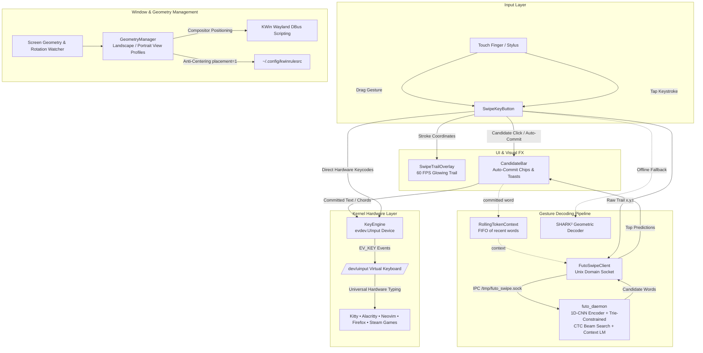

# 🌌 Aurora Touch Keyboard

<div align="center">

[-38bdf8?style=for-the-badge&logo=kde&logoColor=white)](https://kde.org)
[](https://kernel.org)
[](https://github.com/futo-org)
[](https://python.org)
[](LICENSE)

<h3>The Next-Generation Glassmorphic On-Screen Keyboard for Linux Tablets, 2-in-1s & Handhelds</h3>

<p align="center">
  <b>Kernel-level <code>/dev/uinput</code> hardware typing</b> • <b>Real-time neural swipe-to-type</b> • <b>Continuous terminal modifier chording</b> • <b>Zero focus stealing</b> • <b>Dual-orientation view profiles</b>
</p>

<br/>


<br/><br/>

[✨ Features](#-why-aurora) • [🆚 Comparison](#-how-aurora-compares) • [🌍 Portability](#-portability--hardware-matrix) • [🏗️ Architecture](#-system-architecture) • [🚀 Quickstart](#-quickstart) • [🎨 Themes](#-themes--customization) • [🤝 Contributing](#-contributing)

</div>

---

## ⚡ The Problem with Linux Touch Keyboards Today

If you've ever tried using a Linux tablet (Surface Pro, Dell Latitude Detachable, ThinkPad Fold), 2-in-1 laptop, or gaming handheld (Steam Deck, ROG Ally, Legion Go) on Wayland, you know the frustration:

* ❌ **Maliit & Squeekboard**: Rigid full-width bottom docks that eat 50% of your screen, zero swipe typing, and terminal modifier keys (`Ctrl+Shift+▲` buffer scrolling, `Ctrl+C`) reset after a single tap.
* ❌ **Onboard & Florence**: Ancient X11 relics that completely crash, glitch, or fail to composite under modern Wayland compositors (Plasma 6, GNOME 46+, Hyprland).
* ❌ **IBus / Fcitx Virtual Panels**: Rely on application-level text-input protocols that **flatly ignore raw terminals (Kitty, Alacritty, Foot), Neovim, TTYs, games, and sandboxed Flatpaks**.

**Aurora solves touch input on modern Linux once and for all.**

---

## 🚀 Why Aurora?

```
┌─────────────────────────────────────────────────────────────────────────────────────────┐
│                                  Aurora Touch Keyboard                                  │
│                                                                                         │
│  ❖ Drag   [All] [Copy] [Paste] [Esc] [Tab]   📌 Set Default   −  [100% ▾]  +   ◢ Resize │
│  [Auto-Dock ▾]   [⬇ Dock]   [QWERTY ▾]   [Aurora Glass ▾]   [ 🗕 ]   [ ✕ ]              │
├─────────────────────────────────────────────────────────────────────────────────────────┤
│  ⚡ FUTO   [ ✓ aurora ]   [ authority ]   [ auto ]   [ around ]                 [ ✕ ]    │
├─────────────────────────────────────────────────────────────────────────────────────────┤
│   1     2     3     4     5     6     7     8     9     0     -     =     ⌫ Backspace   │
│  Tab    q     w     e     r     t     y     u     i     o     p     [     ]     \       │
│  Caps   a     s     d     f     g     h     j     k     l     ;     '     Enter ↵       │
│  Shift  z     x     c     v     b     n     m     ,     .     /     Shift ⇧             │
│  [Ctrl] [Super ❖] [Alt] [                Space                 ] [AltGr] [◄][▲][▼][►]   │
└─────────────────────────────────────────────────────────────────────────────────────────┘
```

### 1. ⚡ True Kernel-Level Hardware Events (`/dev/uinput`)
Emits genuine physical `EV_KEY` hardware keystrokes directly into the Linux kernel via `/dev/uinput`. It works **universally across everything**: Kitty, Neovim, Firefox, Steam games, TTYs, and sandboxed Flatpaks without depending on IBus or XTest.

### 2. 🧠 State-of-the-Art Neural Swipe-to-Type
Powered by **FUTO Swipe's** edge neural encoder (`honorable_sturgeon`, a 1D-CNN spatial model) running via ExecuTorch, decoded with a **trie-constrained CTC beam search** ported directly from FUTO's own published reference implementation — not a hand-rolled approximation.
* **~14ms mean decode latency**, end-to-end socket round trip on this hardware — down from ~240ms before the beam search rewrite, measured on the project's own headless synthetic-trajectory benchmark.
* **100% top-1 accuracy on multi-syllable words** (*infrastructure, characteristic, sustainability, implementation...*) on that same internal benchmark, up from 35.5% under the previous greedy-decode approach — see [`VOCAB_CONTEXT_SPEC.md`](VOCAB_CONTEXT_SPEC.md) for the full before/after methodology.
* **Context-aware disambiguation**: an ephemeral rolling window of recently-typed words feeds FUTO's trained context language model (`hungry_jellyfish`), so ambiguous swipes are resolved using what you just typed (e.g. *"critical"* correctly biases a following swipe toward *"infrastructure"* over shape-alike distractors).
* **Instant Auto-Commit**: Top candidate is immediately typed with a trailing space upon lifting your finger.
* **One-Tap Candidate Chips**: Tap secondary chips to auto-backspace and substitute words instantly.
* **Zero-Dependency Fallback**: If the neural daemon is offline, automatically falls back to an internal SHARK² geometric decoder.

### 3. 🪄 Glowing Neon Gesture Trail
A transparent 60 FPS overlay renders anti-aliased Bézier glowing neon trails matching your active glassmorphic theme, complete with smooth exponential decay fading.

### 4. ⌨️ Continuous Terminal Modifier Chording (Kitty / Neovim Fix)
Persistent modifier latching lets you lock `Ctrl+Shift` and tap `▲ Up` or `▼ Down` repeatedly to smoothly scroll terminal buffers without modifiers resetting between keystrokes. Releasing `Super ❖` emits a clean tap to toggle your application launcher.

### 5. 📐 Dual-Orientation View Profiles (Landscape & Portrait)
Tablets rotate — KWin rules don't. Aurora's **View Profile Architecture** maintains independent coordinates, dimensions, dock modes, and button typography for Landscape vs. Portrait views:
* **Auto-Dock Default**: Automatically docks centered at the bottom of the screen with taskbar clearance buffer.
* **📌 Set Default Calibration**: Drag or resize the keyboard to your ideal spot and tap **`📌 Set Default`** to lock it in for that orientation.
* **Direct KWin DBus Placement**: Instructs the Wayland compositor to reposition the window in $<20\text{ms}$ on rotation or restore, completely bypassing default window centering.

### 6. 🔍 Dynamic Touch Tiling (25% Mini to 125% Large)
Resize on the fly with the touch finger corner grip (`◢ Resize`), `+`/`−` zoom stepper buttons, or scale presets down to a compact **25% Mini** or **50% Quadrant** tile for side-by-side multitasking.

### 7. 🗕 Collapsible Touch Launcher Badge
Click **`🗕`** to collapse the keyboard into a sleek 160×160 floating touch badge anchored in the corner of your screen. Tap the badge anytime to instantly restore the keyboard.

---

## 🆚 How Aurora Compares

| Feature | Maliit / Squeekboard | Onboard (X11) | GNOME OSK | **Aurora Touch Keyboard** |
|---|---|---|---|---|
| **Terminal & Neovim Compatibility** | ❌ Broken | ⚠️ X11 Only | ❌ Broken | 🟢 **100% Universal (`/dev/uinput`)** |
| **Neural Swipe-to-Type** | ❌ None | ❌ None | ❌ None | 🟢 **FUTO Neural + Trie Beam Search + Context LM** |
| **Glowing Gesture Trail** | ❌ None | ❌ None | ❌ None | 🟢 **60 FPS Anti-Aliased Glow** |
| **Continuous Terminal Chording** | ❌ Resets on Tap | ⚠️ Partial | ❌ Resets on Tap | 🟢 **Full Multi-Modifier Latching** |
| **Wayland Focus Isolation** | ⚠️ Protocol-dependent | ❌ Focus Steals | ⚠️ Fixed Dock Only | 🟢 **Native (`WindowDoesNotAcceptFocus`)** |
| **Dual Landscape/Portrait Profiles**| ❌ Stretches | ❌ None | ❌ None | 🟢 **Dedicated View Profiles & Calibration** |
| **Tiling Scaling (25% to 125%)** | ❌ Fixed Bar | ⚠️ Clunky | ❌ Fixed Bar | 🟢 **Dynamic Corner Grip & Presets** |
| **Glassmorphic Theming** | ❌ Plain Flat | ❌ 2000s Skeuomorphic | ❌ System Default | 🟢 **4 Curated Glassmorphic Themes** |

---

## 🌍 Portability & Hardware Matrix

### 🖥️ Desktop Environments & Compositors
| Environment | Protocol | Status | Window Movement Method |
|---|---|---|---|
| **KDE Plasma 6** | Wayland (KWin) | 🟢 **Primary Target** | Direct KWin DBus Scripting + `startSystemMove()` |
| **KDE Plasma 5.27+** | Wayland / X11 | 🟢 Fully Supported | `startSystemMove()` / X11 Move |
| **GNOME 45 / 46+** | Wayland (Mutter) | 🟢 Fully Supported | Native `startSystemMove()` |
| **Hyprland / Sway / Wayfire** | Wayland (wlroots) | 🟢 Fully Supported | Floating window rule / Layer rule |
| **SteamOS / Gamescope** | Wayland Handheld | 🟢 Fully Supported | Floating Overlay |
| **X11 Standalone (i3/bspwm/XFCE)**| X11 | 🟢 Fully Supported | Native X11 event loop |

### 📱 Supported Devices
* **2-in-1 Tablet PCs**: Dell Latitude 7320/7210 Detachable, Microsoft Surface Pro series (Pro 4–10 / Go), Lenovo ThinkPad X1 Fold / Yoga, HP Spectre x360, Framework Laptop 13 Touch.
* **Handheld PCs**: Valve Steam Deck (LCD & OLED), ASUS ROG Ally / Ally X, Lenovo Legion Go, GPD Win, OneXPlayer.
* **ARM64 Devices**: Raspberry Pi 4 & 5 (Official Touchscreen), Pine64 PineTab 2, Rockchip RK3588 Tablets.

---

## 🏗️ System Architecture



---

## 🚀 Quickstart

### 1. Install Dependencies

#### Fedora / Universal Blue / Bazzite / Aurora OS:
```bash
sudo dnf install python3-pyqt6 python3-evdev
```

#### Arch Linux / Manjaro / Asahi Linux (Apple Silicon):
```bash
sudo pacman -S python-pyqt6 python-evdev
```

#### Ubuntu / Debian / Raspberry Pi OS:
```bash
sudo apt install python3-pyqt6 python3-evdev
```

---

### 2. Enable `/dev/uinput` Access (One-Time Setup)
To allow Aurora to type without requiring `sudo` / root permissions:

```bash
# Add your user to the input group:
sudo usermod -aG input $USER

# Or install the udev rule:
echo 'KERNEL=="uinput", GROUP="input", MODE="0660", OPTIONS+="static_node=uinput"' | sudo tee /etc/udev/rules.d/99-uinput.rules
sudo udevadm control --reload-rules && sudo udevadm trigger
```
*(Log out and log back in once for group changes to take effect).*

---

### 3. Clone & Install

```bash
git clone https://github.com/b0id/aurora-keyboard.git
cd aurora-keyboard

# Run installer (creates ~/.local/bin links, .desktop entry, and autostart entry):
./install.sh

# Start the neural swipe daemon in background:
./aurora-futo-daemon &

# Launch Aurora Touch Keyboard:
aurora-keyboard
```

---

## 🎨 Themes & Customization

Aurora ships with 4 meticulously crafted glassmorphic themes:

| Theme | Aesthetic | Neon Trail Color | Preview |
|---|---|---|---|
| **Aurora Glass** *(Default)* | Deep Slate Glassmorphic Translucency | Cyan Neon (`#38bdf8`) | Translucent blur with subtle border highlights |
| **Cyber Neon** | Cyberpunk High-Contrast Dark | Neon Rose (`#f43f5e`) | High-visibility neon accents |
| **OLED Dark** | Pitch Black Pure Contrast (Battery Saver) | Crisp White (`#ffffff`) | Absolute black for OLED displays |
| **Light Velvet** | Sleek Light Mode Surface | Sky Blue (`#0284c7`) | Modern frosted light appearance |

Switch themes live via the top action bar dropdown, or launch with a specific theme and layout:
```bash
aurora-keyboard --theme "Cyber Neon" --layout "DEV"
```

---

## ⚙️ Placement & Orientation Calibration Guide

1. **Auto-Dock (Default)**: Aurora opens docked cleanly to the bottom of your screen.
2. **Custom Placement in Landscape**:
   - Drag the keyboard by the **`❖ Drag`** handle anywhere on screen.
   - Resize it with the **`◢ Resize`** corner grip.
   - Click **`📌 Set Default`** on the top action bar to lock your Landscape preset.
3. **Custom Placement in Portrait**:
   - Rotate your tablet to Portrait orientation.
   - Drag and resize the keyboard to your preferred portrait position.
   - Click **`📌 Set Default`** to lock your Portrait preset.
4. Rotating your tablet will now seamlessly switch between your saved Landscape and Portrait profiles!

---

## 🧪 Test Suite

Run the full automated unit and integration test suite:

```bash
python3 -m unittest discover -s tests -p "test_*.py"
```

---

## 🤝 Contributing

Contributions are warmly welcomed! Feel free to submit issues, feature requests, or pull requests:
* 💡 **Dictionary & Lexicons**: Add specialized terminology, developer keywords, or localized dictionaries.
* 📱 **Compositor Profiles**: Help test and refine layer-shell rules for Sway, Hyprland, and GNOME.
* 🎨 **New Themes**: Submit custom QSS glassmorphic colorways.

---

## 📜 License & Acknowledgements

* **Aurora Touch Keyboard Core**: Licensed under the **GNU General Public License v3.0 (GPL-3.0-or-later)**. Strong copyleft guarantees that any derivative works and forks remain 100% free and open source.
* **Neural Gesture Models**: Powered by [FUTO Swipe](https://github.com/futo-org) under the FUTO Model Weights License 1.0.

<div align="center">
  <sub>Built with ❤️ for the Linux Tablet & Handheld Community.</sub>
</div>
