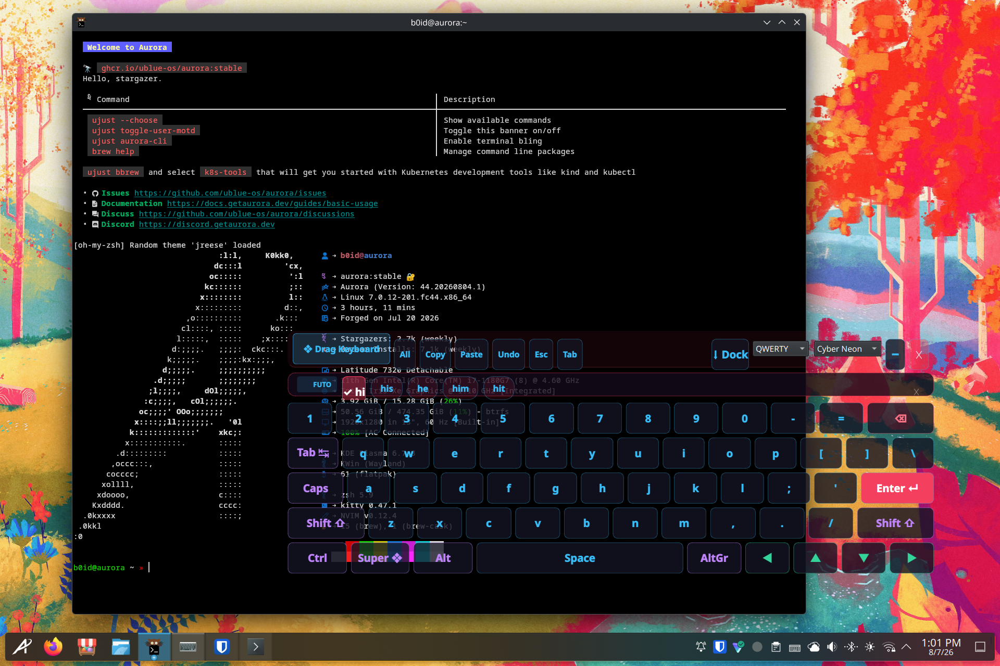
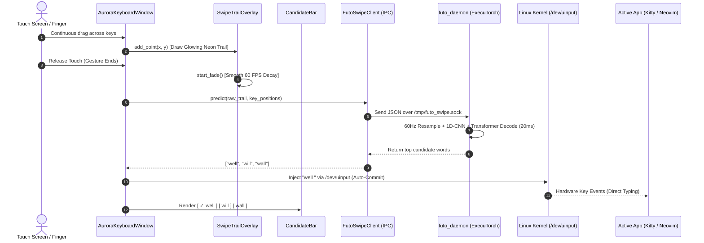

# 🌌 Aurora Touch Keyboard

<div align="center">

[-blue?style=for-the-badge&logo=kde)](https://kde.org)
[](https://kernel.org)
[](https://github.com/futo-org)
[](LICENSE)

**The first Wayland-native, glassmorphic floating on-screen keyboard for Linux tablets and handhelds featuring kernel-level `/dev/uinput` hardware typing, continuous terminal chording, and real-time neural swipe-to-type.**

<br/>



<br/><br/>

[Features](#-why-aurora) • [Portability Matrix](#-portability-matrix) • [Architecture](#-architecture) • [Quickstart](#-quickstart) • [Themes](#-themes--customization) • [Contributing](#-contributing)

</div>

---

## ⚡ The Problem with Linux Touch Keyboards Today

If you've ever used a Linux tablet (Surface Pro, Dell Latitude Detachable, ThinkPad X1 Fold), 2-in-1 laptop, or gaming handheld (Steam Deck, ROG Ally, Legion Go) on Wayland, you know the struggle:

* **Maliit / Squeekboard**: Rigid, clunky dock placement, no floating mode, zero swipe-to-type, and terminal modifier keys (`Ctrl+Shift+Up` scrolling, `Ctrl+C`) are frustratingly broken.
* **Onboard / Florence**: Ancient X11 relics that completely crash or fail to composite under modern Wayland compositors (Plasma 6, GNOME 46+, Hyprland).
* **IBus / Fcitx Virtual Panels**: Rely on application-level input method hooks that flatly ignore raw terminals (Kitty, Alacritty), TTYs, Neovim, games, and sandboxed Flatpaks.

---

## 🚀 Why Aurora is Different

Aurora was built from the ground up to solve touch input on modern Linux once and for all:

```
┌─────────────────────────────────────────────────────────────────────────────┐
│                           Aurora Touch Keyboard                             │
│                                                                             │
│  ❖ Drag Keyboard   [All] [Copy] [Paste] [Undo] [Esc] [Tab]   [⬇ Dock] [🗕]  │
├─────────────────────────────────────────────────────────────────────────────┤
│  ⚡ FUTO  [ ✓ well ]  [ will ]  [ wall ]  [ we ]                   [ ✕ ]     │
├─────────────────────────────────────────────────────────────────────────────┤
│   1   2   3   4   5   6   7   8   9   0   -   =   ⌫                         │
│  Tab  q   w   e   r   t   y   u   i   o   p   [   ]   \                     │
│  Caps a   s   d   f   g   h   j   k   l   ;   '   Enter ↵                   │
│  Shift  z   x   c   v   b   n   m   ,   .   /   Shift                       │
│  [Ctrl] [Super] [Alt] [            Space            ] [AltGr] [◄][▲][▼][►]  │
└─────────────────────────────────────────────────────────────────────────────┘
```

1. **True Kernel-Level Hardware Events (`/dev/uinput`)**:
   Emits genuine physical `EV_KEY` hardware keystrokes directly at the kernel layer. It works universally in Kitty, Neovim, Firefox, Steam games, TTYs, and sandboxed Flatpaks without depending on IBus or XTest.
2. **Wayland-Native Zero-Focus-Stealing**:
   Combines `WindowDoesNotAcceptFocus` + `WA_ShowWithoutActivating` with KWin's native `startSystemMove()` protocol. You can drag, dock, tap, and swipe without your target application ever losing cursor focus.
3. **State-of-the-Art Neural Swipe-to-Type**:
   Powered by **FUTO Swipe's** 1D-CNN spatial encoder (`honorable_sturgeon`) and transformer sequence decoder (`magic_macaw`). Delivers sub-25ms neural word prediction with time-aware $60\text{ Hz}$ kinematics, deduplicated phoneme recognition (*tree*, *good*, *well*), and instant auto-commit on gesture release.
4. **Continuous Terminal Chording (Kitty Scrolling Fix)**:
   Persistent latched modifier engine lets you lock `Ctrl+Shift` and tap `▲ Up` repeatedly to smoothly scroll terminal buffers without modifiers resetting between keystrokes.
5. **Zero-Dependency Fallback Engine**:
   If the neural daemon is offline, Aurora automatically falls back to an internal SHARK²-style geometric polyline decoder with zero external ML dependencies.
6. **Glassmorphic Aesthetic**:
   Ultra-modern floating UI with 4 curated themes, anti-aliased glowing gesture trails, dynamic auto-commit candidate bar, and a collapsible floating corner badge.

---

## 🌍 Portability Matrix

Aurora runs anywhere modern Linux and `/dev/uinput` exist:

### 🖥️ Desktop Environments & Compositors
| Environment | Protocol | Status | Movement Method |
|---|---|---|---|
| **KDE Plasma 6** | Wayland (KWin) | 🟢 Fully Supported (Primary) | `startSystemMove()` Native |
| **KDE Plasma 5** | Wayland / X11 | 🟢 Fully Supported | `startSystemMove()` / X11 Move |
| **GNOME 45 / 46+** | Wayland (Mutter) | 🟢 Fully Supported | `startSystemMove()` Native |
| **Hyprland / Sway / Wayfire** | Wayland (wlroots) | 🟢 Fully Supported | Floating rule / Layer |
| **Gamescope / SteamOS** | Wayland | 🟢 Fully Supported | Floating Overlay |
| **X11 Standalone (i3/bspwm/XFCE)** | X11 | 🟢 Fully Supported | Manual Global Offset |

### 📱 Target Devices & Architectures
* **2-in-1 Tablets**: Dell Latitude 7320 Detachable, Microsoft Surface Pro series, ThinkPad X1 Fold, HP Spectre x360, Lenovo Yoga.
* **Handheld PC Consoles**: Valve Steam Deck (LCD & OLED), ASUS ROG Ally, Lenovo Legion Go, GPD Win.
* **Architectures**: `x86_64`, `aarch64` (ARM64 / Raspberry Pi / PineTab / Rockchip).

---

## 🏗️ Architecture



---

## 📦 Quickstart

### 1. Prerequisites (x86_64 & ARM64)
* Python 3.9+ with PyQt6 and evdev:
```bash
# Fedora / RHEL / Bazzite / Aurora (x86_64 & aarch64):
sudo dnf install python3-pyqt6 python3-evdev

# Arch Linux & Asahi Linux ARM (Apple Silicon M1/M2/M3):
sudo pacman -S python-pyqt6 python-evdev

# Ubuntu / Debian / Raspberry Pi OS (Pi 4 & 5):
sudo apt install python3-pyqt6 python3-evdev

# Alpine Linux / PostmarketOS (PineTab / PinePhone):
sudo apk add py3-qt6 py3-evdev
```

### 2. Enable `/dev/uinput` Access (One-Time)
To allow typing without running as root:
```bash
sudo usermod -aG input $USER
# Or install the udev rule:
echo 'KERNEL=="uinput", GROUP="input", MODE="0660", OPTIONS+="static_node=uinput"' | sudo tee /etc/udev/rules.d/99-uinput.rules
sudo udevadm control --reload-rules && sudo udevadm trigger
```

### 3. Run the App
```bash
git clone https://github.com/your-username/aurora-keyboard.git
cd aurora-keyboard

# Install desktop entry & autostart launcher:
./install.sh

# Start the neural swipe daemon (runs standalone or in container):
./aurora-futo-daemon &

# Start the keyboard:
./aurora-keyboard
```

---

## 🎨 Themes & Customization

Aurora ships with 4 tailored QSS glassmorphic themes:

| Theme | Aesthetic | Gesture Trail Color |
|---|---|---|
| **Aurora Glass** (Default) | Deep Slate Glassmorphic Translucency | Cyan Neon (`#38bdf8`) |
| **Cyber Neon** | Cyberpunk High-Contrast Dark | Neon Rose (`#f43f5e`) |
| **OLED Dark** | Pitch Black Pure Contrast (Power Saver) | Crisp White (`#ffffff`) |
| **Light Velvet** | Sleek Light Mode Surface | Sky Blue (`#0284c7`) |

Switch themes on the fly from the title bar dropdown or launch directly:
```bash
aurora-keyboard --theme "Cyber Neon" --layout "DEV/TERM"
```

---

## 🤝 Contributing

We welcome contributions from developers, designers, and tablet enthusiasts!

1. **Swipe Trajectories**: Donate real $(x, y, t)$ swipe captures to expand gesture datasets.
2. **Vocabulary & Slang**: Add specialized terminology, programming keywords, or localized dictionaries.
3. **Compositor Profiles**: Test and tune layer-shell / window rules for Sway, Hyprland, and GNOME.

---

## 📜 License & Copyleft Protection

* **Aurora Keyboard Core**: Licensed under the **GNU General Public License v3.0 (GPL-3.0-or-later)**. Strong copyleft guarantees that any derivative works, forks, and commercial distributions must remain 100% free and open source.
* **Neural Gesture Models**: Powered by [FUTO Swipe](https://github.com/futo-org) under the FUTO Model Weights License 1.0.
